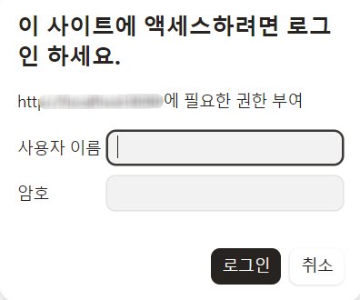
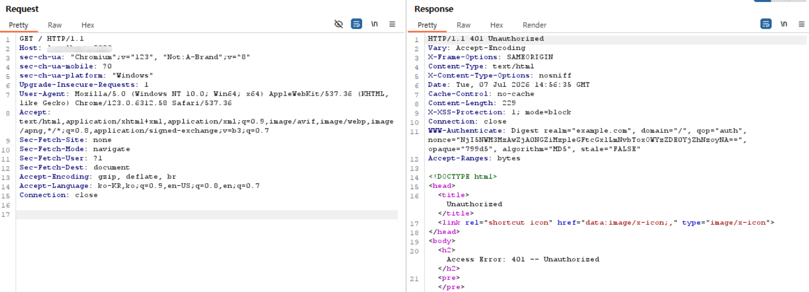
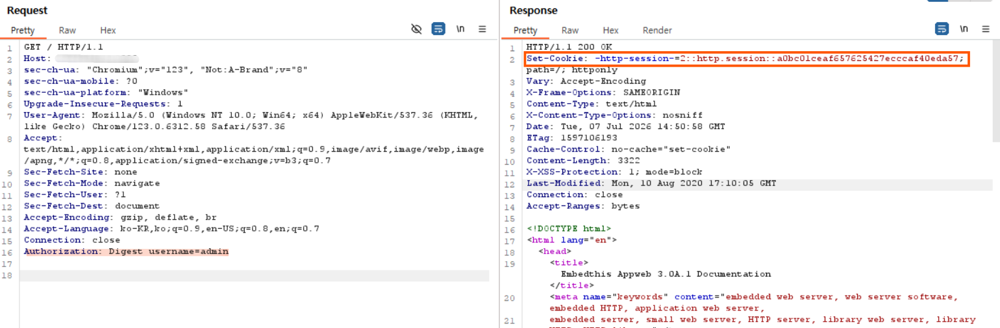
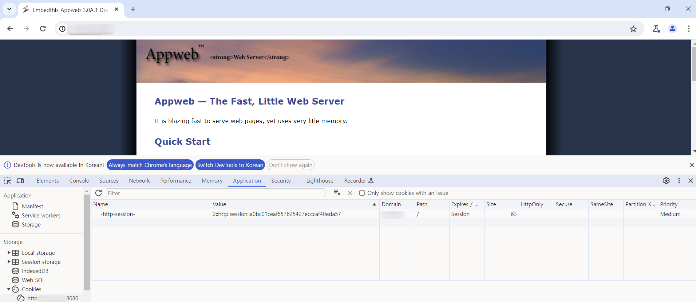

# **AppWeb 인증 우회 취약점 (CVE-2018-8715)** 

## 요약
- Appweb은 Embedthis Software가 개발한 C/C++ 기반의 경량 임베디드 웹 서버로, 리소스가 제한적인 임베디드 기기나 소형 애플리케이션에 웹 서버 기능을 붙이기 위해 활용된다.
- Appweb에는 Basic, Digest, Form이라는 세 가지 인증 방법이 포함되어 있다. 
- Embedthis HTTP 라이브러리와 7.0.3 이전 버전의 Appweb에는 `http/httpLib.c`의 `authCondition` 함수와 관련된 논리적 결함이 존재한다.
- 이 결함으로 인해 위조된 HTTP 요청을 통해 Form 및 Digest 로그인 방식의 인증을 우회할 수 있다.

참고 자료
- https://ssd-disclosure.com/index.php/archives/3676 
  
## 환경 구성
다음 명령을 실행하여 Digest 인증이 포함된 Appweb 7.0.1 서버를 시작한다:
```
docker compose up -d
```
`http://your-ip:8080`에 액세스하려면 계정 비밀번호를 입력해야 한다. 


## 취약 조건
- Appweb 7.0.3 이전 버전
- 서버 설정(`appweb.conf`)에서 Digest 또는 Form 방식의 인증이 활성화되어 있을 것 
- 공격자가 시스템에 등록된 유효한 username을 알고 있을 것 

## 재현 절차 및 실행 결과
인증 헤더 없이 접속하면 `401 Unauthorized`가 반환된다.

정상적인 Digest 인증에 필요한 `nonce`, `response` 해시값 없이, `username`
파라미터만 포함된 위조된 Authorization 헤더를 추가해 요청을 재전송했다:
```
Authorization: Digest username=admin      // request에 다음 헤더를 추가한다.  
```
응답이 `200 OK`로 전환되며 인증된 페이지 콘텐츠가 반환되고, `Set-Cookie`를 통해
인증된 세션이 발급되는 것을 확인했다. 

발급된 세션으로 페이지에 정상적으로 접근할 수 있다.


## 대응 방안
- Appweb **7.0.3 이상**으로 업그레이드한다.
- 즉시 패치가 어려운 경우, 리버스 프록시나 WAF 수준에서 `Authorization` 헤더 값을 추가로 검증하는 규칙을 적용해 불완전한 Digest 헤더 요청을 차단한다.
- 관리자 페이지 등 인증이 필요한 엔드포인트는 IP 화이트리스트 또는 VPN 뒤에 배치해 외부 직접 노출을 최소화한다. 
